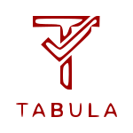

# TABULA - Take Back Your Life Again

<p align="center">
  
</p>

<p align="center">
  A powerful Chrome extension that transforms digital distractions into productivity moments by presenting your tasks when you need them most.
</p>

<p align="center">
  <a href="#features">Features</a> •
  <a href="#installation">Installation</a> •
  <a href="#usage">Usage</a> •
  <a href="#privacy">Privacy</a> •
  <a href="#development">Development</a> •
  <a href="#support">Support</a>
</p>

---

## 🎯 What is TABULA?

TABULA is a privacy-first productivity tool that helps you reclaim your time from digital distractions. When you visit potentially time-wasting websites like Reddit, YouTube, or social media, TABULA automatically displays a beautiful full-screen overlay showing your task list, gently reminding you of your real priorities.

The name TABULA comes from "tabula rasa" (blank slate), representing the fresh start you get each day to reclaim your time. The acronym also stands for **T**ake **B**ack **Your** **L**ife **A**gain.

## ✨ Features

### Core Functionality (v0.2.6)
- 📝 **Smart Task Management** - Add, complete, delete, and drag-to-reorder tasks
- 🎯 **Priority System** - Mark tasks as High/Medium/Low with color coding
- 📅 **Due Dates** - Set deadlines for your tasks
- ↩️ **Undo Support** - Cmd/Ctrl+Z to undo deletions, completions, or moves
- 🌐 **Domain Detection** - Automatically appears on configured websites
- ⏱️ **Flexible Timing** - Snooze (quick tasks) or dismiss (focused work)
- 🎨 **Beautiful Design** - Clean, modern interface with dark/light themes
- 💬 **Inspirational Quotes** - Rotating motivational quotes to keep you focused
- 🔄 **Real-time Sync** - Tasks synchronize across all browser tabs
- 🔒 **100% Private** - All data stored locally, no tracking or external servers

### Smart Interventions
TABULA intelligently intervenes when you visit:
- Reddit (with personalized message about not gifting time to Reddit)
- YouTube (resistant to YouTube's CSS interference)
- X/Twitter (formerly Twitter)
- Any custom domains you configure

## 📦 Installation

### Option 1: Chrome Web Store (Coming Soon)
The extension will be available on the Chrome Web Store soon.

### Option 2: Developer Mode (Available Now)
1. Clone the repository:
   ```bash
   git clone https://github.com/temporalparts/todo-overlay.git
   cd todo-overlay/extension
   ```

2. Install dependencies and build:
   ```bash
   npm install
   npm run build
   ```

3. Load in Chrome:
   - Open Chrome and go to `chrome://extensions`
   - Enable "Developer mode" (top right)
   - Click "Load unpacked"
   - Select the `extension/dist` folder

4. Test it:
   - Navigate to reddit.com, youtube.com, or x.com
   - TABULA will appear automatically
   - Or click the extension icon to activate on any site

## 🚀 Usage

### Getting Started
1. **Add your first task** - Type in the input field and press Enter
2. **Visit a distracting site** - Go to Reddit, YouTube, or X/Twitter
3. **See TABULA in action** - Your tasks appear, reminding you of priorities
4. **Choose your path**:
   - Complete a task and mark it done ✓
   - Snooze for a few minutes if you need to handle something urgent
   - Dismiss for longer if you've earned focused recreation time

### Task Management
- **Add Task**: Type and press Enter or click Add
- **Complete Task**: Click the checkbox
- **Delete Task**: Hover and click the trash icon
- **Reorder Tasks**: Drag and drop to prioritize
- **Set Priority**: Choose High, Medium, or Low with color indicators
- **Add Due Date**: Click the calendar icon
- **Undo Actions**: Cmd/Ctrl+Z

### Time Controls
- **Snooze**: Brief pause (default 15 minutes, customizable)
- **Dismiss**: Longer break (default 60 minutes, customizable)
- **Manual Trigger**: Click extension icon on any website

### Settings
Access settings through the Settings tab in the overlay:
- Configure which domains trigger TABULA
- Adjust snooze and dismiss durations
- Choose theme (light/dark/auto)
- Enable/disable quote rotation
- Manage task settings

## 🔒 Privacy

**Your data is yours, always.**

- ✅ **100% Local Storage** - All data stays on your device
- ✅ **No Tracking** - Zero analytics or telemetry
- ✅ **No External Servers** - Works completely offline
- ✅ **Open Source** - Fully auditable code
- ✅ **Data Portability** - Export/import your data anytime

[Read our full Privacy Policy](PRIVACY.md)

## 🛠️ Development

### Prerequisites
- Node.js 16+ and npm
- Chrome or Chromium-based browser

### Setup
```bash
# Clone the repository
git clone https://github.com/temporalparts/todo-overlay.git
cd todo-overlay/extension

# Install dependencies
npm install

# Development mode (watches for changes)
npm run dev

# Build for production
npm run build

# Type checking
npm run typecheck
```

### Project Structure
```
extension/
├── src/
│   ├── ui/          # Preact components (App, TaskList, Settings)
│   ├── background/  # Service worker for tab management
│   ├── content/     # Content script for overlay injection
│   ├── state/       # Storage and state management
│   ├── lib/         # Utility functions
│   └── data/        # Static data (quotes)
├── public/          # Static assets and manifest
├── scripts/         # Build and utility scripts
└── dist/           # Built extension (generated)
```

### Key Technologies
- **Frontend**: Preact (lightweight React alternative)
- **Styling**: Tailwind CSS
- **Build**: Vite + TypeScript
- **State**: Zustand + Chrome Storage API
- **Extension**: Manifest V3

### Contributing
We welcome contributions! Please:
1. Fork the repository
2. Create a feature branch
3. Make your changes
4. Submit a pull request

See [extension/README.md](extension/README.md) for detailed development instructions.

## 📚 Documentation

- [Extension Documentation](extension/README.md) - Detailed setup and architecture
- [Privacy Policy](PRIVACY.md) - Our commitment to your privacy
- [Chrome Store Listing](extension/CHROME_STORE_LISTING.md) - Store information
- [Release Notes](extension/RELEASE_v0.2.0.md) - Version history

## 🗺️ Roadmap

### Current Features (v0.2.6)
- ✅ Core task management with drag-and-drop
- ✅ Priority system (High/Medium/Low)
- ✅ Due dates with calendar picker
- ✅ Undo/redo support
- ✅ Domain detection and auto-display
- ✅ Snooze/dismiss timers
- ✅ Dark/light/auto themes
- ✅ Inspirational quote rotation
- ✅ Cross-tab synchronization
- ✅ Data export/import

### Planned Enhancements

#### Phase 1: Core Improvements
- 🏷️ **Tags & Labels** - Organize tasks with custom categories
- 📝 **Markdown Support** - Rich text formatting for task descriptions
- ⌨️ **Keyboard Shortcuts** - Power user navigation
- 🔍 **Search & Filter** - Find tasks quickly

#### Phase 2: Advanced Features
- 🔄 **Recurring Tasks** - Daily/weekly/monthly task templates
- 🔔 **Notifications** - Desktop reminders for due tasks
- 📊 **Analytics** - Track productivity patterns (local only)
- 🎯 **Auto-sort** - Intelligent task prioritization

#### Phase 3: Ecosystem
- 📅 **Calendar Integration** - Sync with Google Calendar/Outlook
- 📱 **Mobile Companion** - iOS/Android apps
- 🌍 **Internationalization** - Multi-language support
- 🔄 **Cloud Sync** - Optional encrypted backup (privacy-first)

See [TODO.md](TODO.md) for detailed feature planning and technical considerations.

## 💬 Support

### Get Help
- [GitHub Issues](https://github.com/temporalparts/todo-overlay/issues) - Report bugs or request features
- [Discussions](https://github.com/temporalparts/todo-overlay/discussions) - Ask questions and share ideas

### Support Development
If TABULA helps you reclaim your time, consider supporting development:

<a href="https://ko-fi.com/temporalparts">
  
</a>

## 📄 License

MIT License - see [LICENSE.txt](LICENSE.txt) for details.

---

<p align="center">
  <strong>Take back your life again.</strong><br>
  Transform every moment of distraction into an opportunity to focus on what truly matters.
</p>

<p align="center">
  Made with ❤️ by <a href="https://github.com/temporalparts">temporalparts</a>
</p>